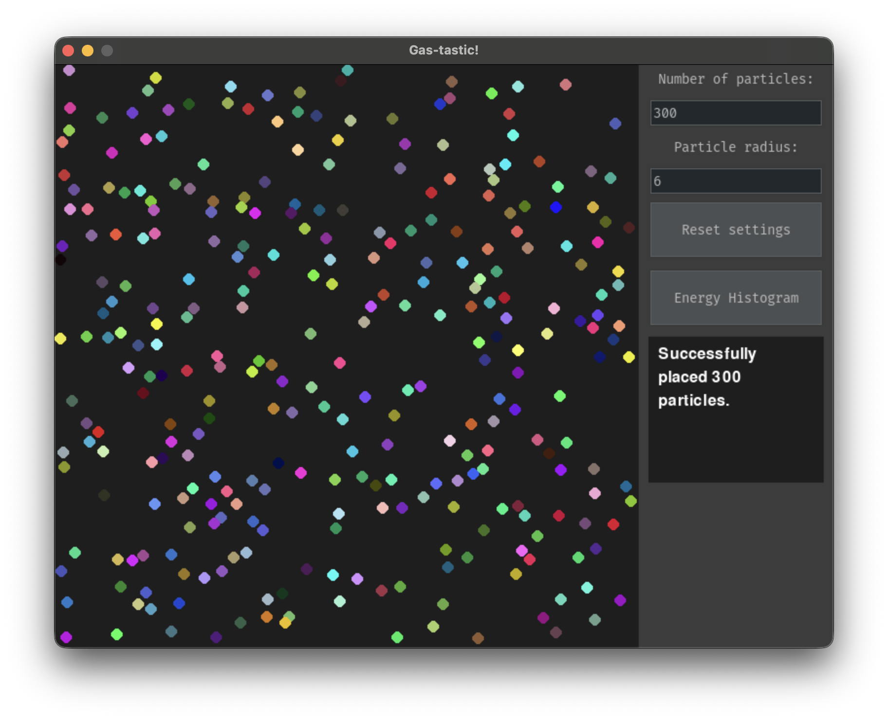
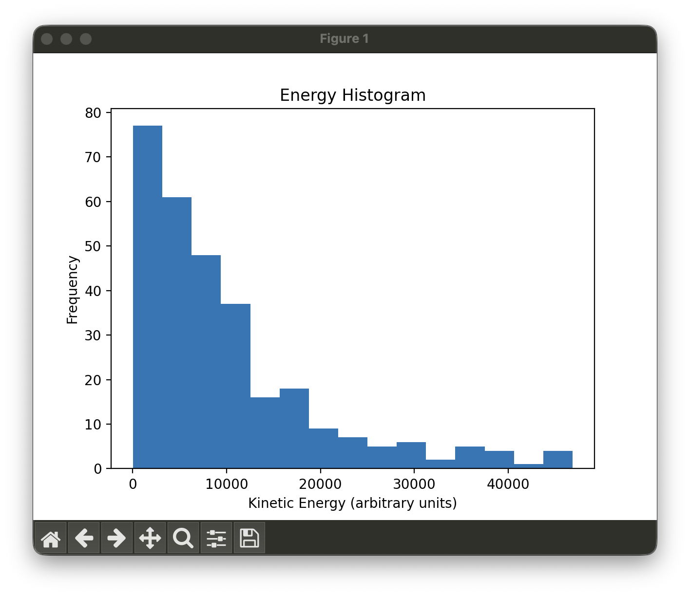

# MolecularMotion2D

A simple 2D gas particle simulation written in Python.

The application simulates particles moving in a two-dimensional box and undergoing elastic collisions. It also includes a small GUI for changing simulation parameters and inspecting the kinetic energy distribution.

## Demo preview


## Screenshots

### Simulation view



### Energy histogram



## Features

- 2D particle motion in a bounded box
- Elastic particle-wall and particle-particle collisions
- Adjustable number of particles
- Adjustable particle radius
- Kinetic energy histogram
- Simple graphical interface

## Project setup

This project requires a virtual environment. Dependencies are listed in `requirements.txt`.

### 1. Create the virtual environment and install dependencies

```bash
python setup.py
```

### 2. Activate the virtual environment

On macOS/Linux:

```bash
source venv/bin/activate
```

On Windows:

```bash
venv\Scripts\activate
```

### 3. Run the simulation

```bash
python main.py
```